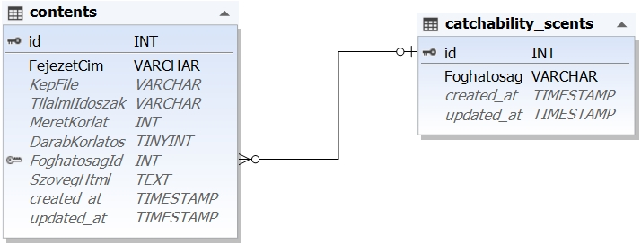

# Környezet telepítés

## Frontend
vite: `npm create vue@latest`

npm frissítése
`npm install -g npm@11.3.0`

bootstrap: `npm i bootstrap@5.3.5`
icons: `npm i bootstrap-icons`
axios: `npm install axios`
node_moduls: `npm install`
`main.js`-ben (import bootstrap, icons):
```js
//main.js
//Bootstrap: css, js
import "bootstrap/dist/css/bootstrap.min.css"
import "bootstrap"
//Icons: css
import "bootstrap-icons/font/bootstrap-icons.min.css"
``


# Az adatbázis
Az adatbázis a horgászvizsga tananyagát tartalmazó két táblás adatbázis kicsit leegyszerűsített formában.

## Diagram


## Mezők és jeletésük
A táblák angol elnevezése mellett az egyes és többesszám, a mezők magyar elnevezése mellett, pedig a jobb érthetőség miatt döntöttünk.

### contents tábla (tartalom)
- **id**: Azonosító
- **FejezetCim**: A horgászkönyv adott fejezetének címe (kötelező)
- **KepFile**: Ha a fejezthez van kép, az annak a neve
- **TilalmiIdoszak**: Egy szöveges tartalom, ami hónap:napTól-hónap:napIg formában írja le a tilami időszakok (nem kötelező)
- **MeretKorlat**: Egy hal méret korlátját adja meg (nem kötlező)
- **DarabKorlatos**: 0: nicsn darab korlát, 1: van (nem jötelező)
- **FoghatosagId**: Egy adott halnál megmondja, hogy milyen foghatósági korlátok vonatkoznak rá. (nem kötelező)
**SzovegHtml**: Az adaott fejezethez tartozó html formázott zsöveges tartalom

### catchability_scents (foghatósági szabályok elnevezései)
- **id**: Azonosító
- **Foghatosag**: A foghatósági szabály neve

# Backend
A backendet (REST API kiszolgáló) egy előre telepített, a `Backend` könytárban  található laravel segítségével készítse el.

# Az adatbázis elkészítése
A mysql szerver elindítása után (xampp)
Két módon lehetséges:
vagy
1. A `horgaszvizsga2025 20250421 2327.sql` nevű sql script futtatásával
vagy
2. A laravel elinditása (`php artisan serve`) után
    - Mingráció futtatása: `php artisan migrate`
    - Seeder futtatása: `php artisan db:seed`

# Endpointok

## request.rest
A request.rest fájlban megtalálhatja az elkészítendő endpointokat, és leírásukat.

## Feladatok

1. Készítse el `Backned/database/csv/horgaszvizsga.sql` fájlba az endpointok alapjául szolgáló **sql lekérdező parancsokat**.
    - horgaszvizsgaTananyag
    - halkartyak
    - halkartyak/id
    - halkartyakGyakorlo

2. `Backned/routes/api.php` **endpointok** elkészítése
    - get /api/horgaszvizsgaTananyag
    - get halkartyak
    - get /api/halkartyak/id
    - get /api/halkartyakGyakorlo

**Help** (endpoint szerkezet példa):
```php
Route::get('eroforras/{parameter}', [ControllerOsztaly::class, 'contolerFuggveny']);
```

3. Az endpointokhoz tartozó **kontroller függvények** elkészítése.
A kontroller függvényeket a `Backend/app/Http/Controllers/ContentController.php` osztályba készítse el.

**Help** (kontroller szerkezet példa)
```php
class ControllerOsztaly extends Controller
{
    //...

    public function contolerFuggveny($parameter){

        $query = 'SELECT  * ...';
        $rows= DB::select($query, [$parameter]);
        $data = [
            'message' => 'ok',
            'data' => $rows
        ];

        return response()->json($data, options:JSON_UNESCAPED_UNICODE);
    }
     //...
}
˛˛˛˛